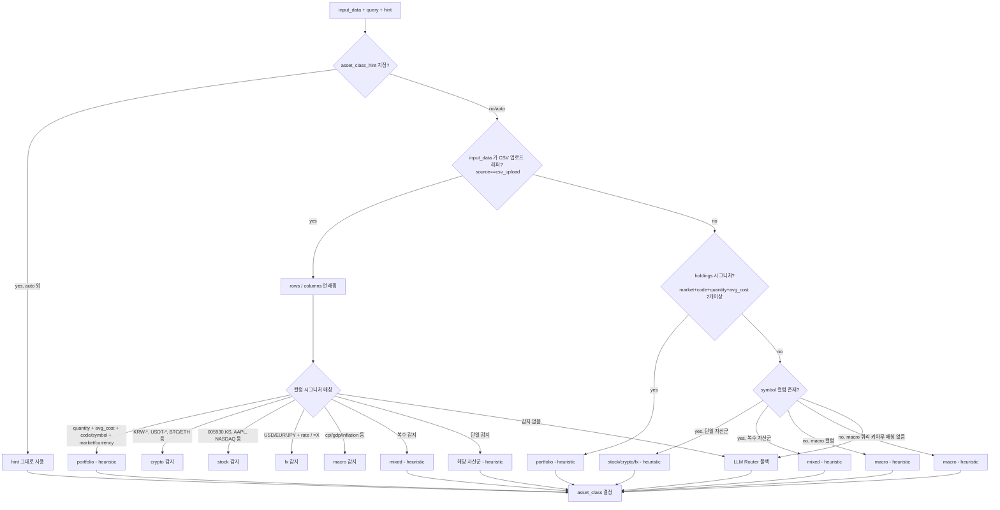

# Meta Router 결정 트리

임의의 투자 데이터 입력을 받아 자산군(`stock`/`crypto`/`fx`/`macro`/`portfolio`/`mixed`)
을 결정하는 파이프라인. **결정적 heuristic** 을 우선 적용하고, 애매한 경우에만
LLM 으로 폴백한다.

## 플로우차트

## 분기 근거 · 예시 · 신뢰도

| 분기 | 입력 예시 | 판별 조건 | 신뢰도 | LLM 호출 |
|---|---|---|---|---|
| hint 우선 | `asset_class_hint = "portfolio"` | hint ∈ {stock/crypto/fx/macro/mixed/portfolio} 이고 `auto` 가 아님 | 1.00 | 0 |
| CSV portfolio | `columns: [market, code, quantity, avg_cost, currency]` | `quantity + avg_cost` 필수 + `code/symbol` + `market/currency` | 0.98 | 0 |
| CSV crypto | `columns: [symbol, close], rows: [{"symbol":"KRW-BTC"}, ...]` | 셀값이 `KRW-*`/`USDT-*`/`BTC/ETH` 등 crypto 티커 패턴 | 0.97 | 0 |
| CSV stock KR/US | `rows: [{"symbol":"005930.KS"}, {"symbol":"AAPL"}]` | `\d{6}\.(KS\|KQ)` 또는 `[A-Z]{1,5}` 패턴 | 0.95 | 0 |
| CSV fx | `rate` 컬럼 + `USD/KRW` 등 | `rate` 열 + 통화코드 또는 `=X` 접미 | 0.92 | 0 |
| CSV macro | `columns: [date, cpi, gdp]` | 컬럼명에 `cpi/gdp/inflation/rate_hike/ppi` 등 | 0.95 | 0 |
| CSV mixed | `rows: [AAPL, KRW-BTC, ...]` | 복수 자산군 심볼/컬럼 동시 감지 | 0.92 | 0 |
| holdings | `rows: [{market:..., code:..., quantity:...}]` | `market/code/quantity/avg_cost` 중 2개 이상이 모든 행에 있음 | 0.95 | 0 |
| symbol 단일 | `rows: [{symbol:"KRW-BTC"}]` | 정규식 패턴 1개 매칭 | 0.95 | 0 |
| symbol 복수 | `rows: [{symbol:"AAPL"}, {symbol:"KRW-BTC"}]` | 패턴 2개 이상 | 0.92 | 0 |
| 컬럼 macro | `rows: [{cpi: 3.1}]` | 컬럼 이름이 매크로 지표 | 0.90 | 0 |
| 쿼리 macro | `query="소비자물가 해석해줘"` | 쿼리에 매크로 키워드 | 0.85 | 0 |
| **LLM 폴백** | 위 조건 모두 실패 | heuristic 으로 결정 불가 | 0.70 | **1** |
| LLM 실패 시 | 네트워크/키 오류 | 예외 catch | 0.50 | 0 |

## Router reason 마커

heuristic 으로 결정된 경우 `router_reason` 문자열 끝에 `(heuristic)` 마커를
붙인다. 데모 UI · 디버깅 로그에서 LLM 호출 여부를 즉시 식별할 수 있다.

- heuristic 결정: `"입력 심볼(AAPL...) 패턴 매칭 → stock (heuristic)"`
- LLM 폴백: `"LLM Router 결정"` (마커 없음)
- hint: `"사용자 hint='portfolio' 수신 → 그대로 사용"`

## 성능 지표 (Week-4)

- 골든 샘플 22종 (18 기존 + 4 CSV) → **heuristic 결정률 100%**
- LLM Router 호출 평균 회수: 0 / analyze 요청 (정상 입력 기준)
- 평균 router latency: < 1 ms (순수 Python regex + dict 조회)

## 테스트

- `backend/tests/golden/test_router_decisions.py` — 기존 18종 회귀
- `backend/tests/golden/test_router_portfolio_routing.py` — portfolio/macro/mixed
- `backend/tests/golden/test_router_csv.py` — CSV 업로드 4종 + 언래핑 검증
- `backend/tests/golden/test_regression_runner.py` — 전체 그래프 end-to-end

프롬프트 또는 heuristic 변경 시 위 4 파일이 모두 green 이어야 PR 승인.
